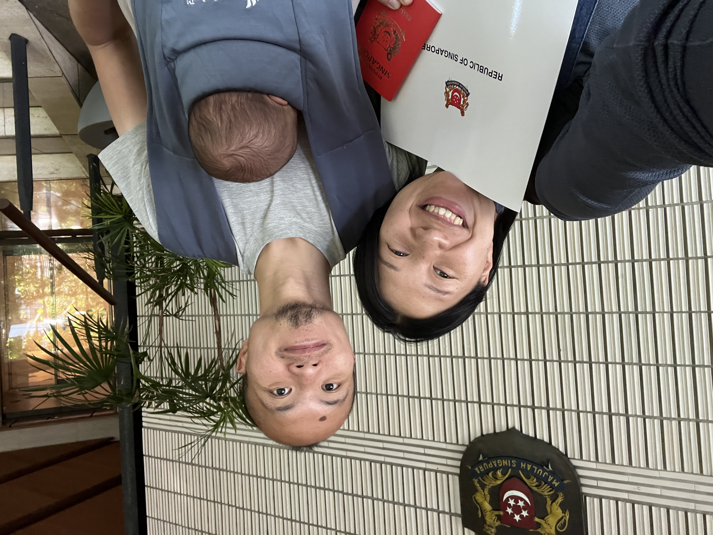

# About Chilli Padi

> Help for first-time Singaporean parents based overseas

My wife and I welcomed our first child in September 2023. He was born overseas (Japan). 👶

As a first-time parent, I struggled with the paperwork to register my child's birth for both Japan and Singapore. Information was aplenty, but it is hard to know where to even start. 😫

Chilli Padi is the guide I wished I had at the start: A guided series of how-tos and whys re: what you need to register with Singapore, for your child born overseas. 📖

If you are a first-time Singaporean parent like myself, note that you're not alone!
I hope this documentation helps you out.

[Let's go!](outline.md)
